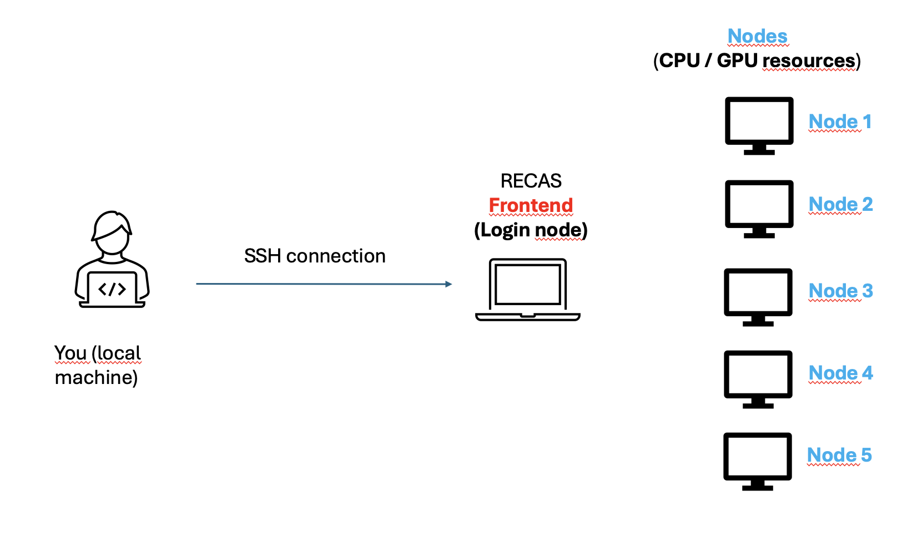

# Recas Configuration Guide

This document describes the configuration and setup procedures for the RECAS system.

## Overview

First of all, it is important to understand how the cluster works.

After obtaining the credentials to access the RECAS cluster, you must also be granted permission to submit jobs on the system (e.g. using `condor_submit`).

If you do not yet have the required permissions, please refer to the following links:

- **[Link 1](https://www.recas-bari.it/index.php/en/recas-bari-servizi-en/richiesta-credenziali-2)**: Request credentials for accessing the RECAS cluster  
- **[Link 2](https://www.recas-bari.it/index.php/en/recas-bari-servizi-en/support-request)**: Request permission to submit jobs with GPU resources (make sure to explicitly mention GPU usage in the request)

These steps are mandatory before proceeding with any job submission or configuration on the cluster.

## Overview – 2

To better understand how the cluster works, let us first introduce a simple conceptual diagram.



From this diagram, it is important to note that when you log into the cluster, you are **connected to the machine called the frontend**.

The frontend node has **very limited resources**, in particular:
- Limited disk space (approximately **200 MB**)
- No computational resources intended for heavy workloads

This means that the frontend **must not be used for computations**, but only for:
- Editing files
- Preparing job scripts
- Managing configurations
- Submitting jobs

This design choice is intentional: the frontend is shared by many users simultaneously. If computational workloads were allowed on the frontend, the system would quickly become overloaded and unusable for everyone.

Therefore, **any actual computation must be performed on dedicated compute nodes**.  
From the frontend, you must connect to another node of the cluster, which is a separate machine with specific computational resources (CPU, GPU, memory) allocated for your job.

In practice, the frontend acts as an **entry point and control node**, while all intensive tasks are executed on the app

## Overview – 3


Referring to the same diagram shown above, it is important to clarify how computations are actually executed on the cluster.

Users **cannot directly log into compute nodes**.  
Instead, access to computational resources (CPU or GPU nodes) is managed by the cluster scheduler.

On RECAS, jobs are submitted using **HTCondor**, through the command:

```bash
condor_submit file_to_submit.sub
```

## Installation

## Installation

Before running jobs on the RECAS cluster, it is strongly recommended to install **Miniconda**, which allows you to manage Python environments and dependencies in a clean and reproducible way.

---

### Step 1: Download and install Miniconda

Download the Miniconda installer for Linux from the official documentation:

https://docs.conda.io/projects/conda/en/stable/user-guide/install/linux.html

From the RECAS frontend, download the installer (example for 64-bit Linux):

```bash
wget https://repo.anaconda.com/miniconda/Miniconda3-latest-Linux-x86_64.sh
```

Make the installer executable and run it:

```bash
chmod +x Miniconda3-latest-Linux-x86_64.sh
./Miniconda3-latest-Linux-x86_64.sh
```

During the installation:
- Accept the license agreement
- Use the default installation path (recommended)
- When asked whether to initialize Miniconda, answer yes

### Step 2: Configure the .bashrc
After installation, Miniconda must be properly initialized every time you open a new shell.
Open your .bashrc file:
```bash
nano ~/.bashrc
```

Add the following lines at the end of the file:

```bash
# >>> conda initialize >>>
# !! Contents within this block are managed by 'conda init' !!
__conda_setup="$("$HOME/miniconda3/bin/conda" 'shell.bash' 'hook' 2> /dev/null)"
if [ $? -eq 0 ]; then
    eval "$__conda_setup"
else
    if [ -d "$HOME/miniconda3" ]; then
        export PATH="$HOME/miniconda3/bin:$PATH"
    fi
fi
unset __conda_setup
# <<< conda initialize <<<
```

Save and close the file, then reload it:

```bash
source ~/.bashrc
```

Verify that conda is available:
```bash
conda --version
```
### Step 3: Create a .bash_profile
Some login sessions use .bash_profile instead of .bashrc.
To ensure consistent behavior across all sessions, create a .bash_profile that sources .bashrc.
Create or edit the file:
```bash
nano ~/.bash_profile
```
Insert the following content:

```bash
if [ -f ~/.bashrc ]; then
    source ~/.bashrc
fi
```
Save and close the file.


### Step 4: Ensure the base environment is always active
Log out and log back into the cluster, or open a new terminal session.
Verify that the base conda environment is active and available:
```bash
which python
conda info
```

If these commands work correctly, Miniconda is properly installed and configured.

## Final Notes
Miniconda is installed locally in your home directory and does not require administrator privileges.
Do not install the full Anaconda distribution (too heavy for cluster usage).
Always use conda environments for project-specific software and experiments.
Never run computational workloads directly on the frontend.


